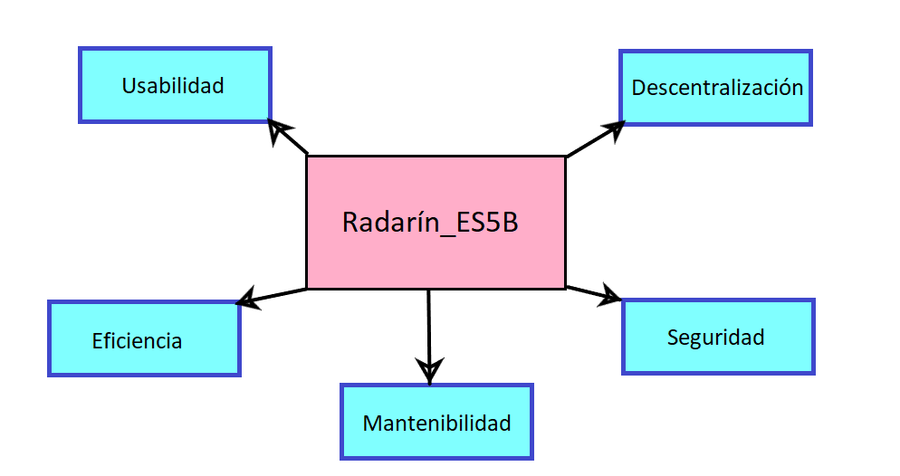

== 10. Requisitos de calidad

=== Árbol de calidad

=== Escenarios de calidad

|===
| *Objetivo de calidad* | *Descripción* | *Solución*

| Descentralización
| Es el objetivo principal de la aplicación. La aplicación no será la que guarde los datos del usuario, sino que lo hará él mismo.
| Uso de los PODs de SOLID para acceder a la aplicación y guardar sus datos.

| Seguridad
| Para proteger los datos de los usuarios de la aplicación.
| Sistema de login y utilización de los PODs.

| Mantenibilidad
| La aplicación es fácil de modificar en cualquier momento, así como de arreglar errores que vayan surgiendo rápidamente.
| Seguir una buena organización de clases y paquetes, que permitan acceder rápido a la parte del código que se necesite, uso de interfaces, etc.

| Eficiencia
| La forma en la que funciona la aplicación. Los tiempos de carga deben ser cortos y el usuario debe saber si en la aplicación está ocurriendo algo o no.
| Realizar pruebas para comprobar la eficiencia de la aplicación e indicar al usuario de lo que está sucediendo en cada momento.

| Usabilidad
| La aplicación debe ser fácil de utilizar para cualquier usuario (nuevos usuarios, usuarios con discapacidades,...)
| Interfaces intuitivas y hechas pensando en cualquier usuario.

|===